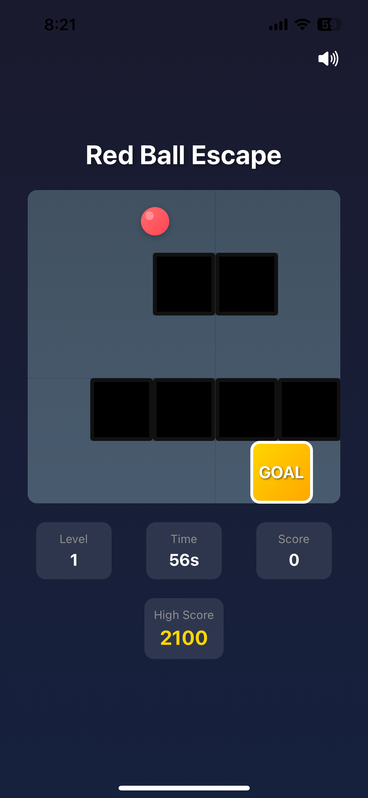
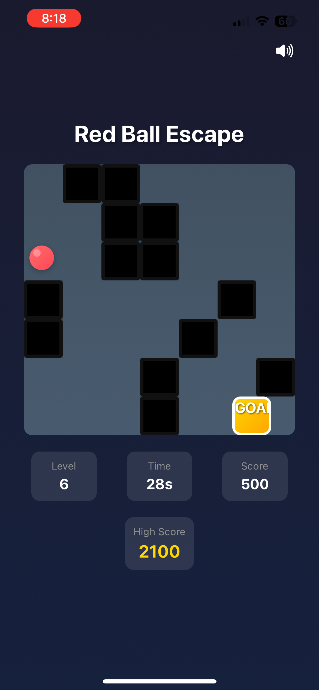
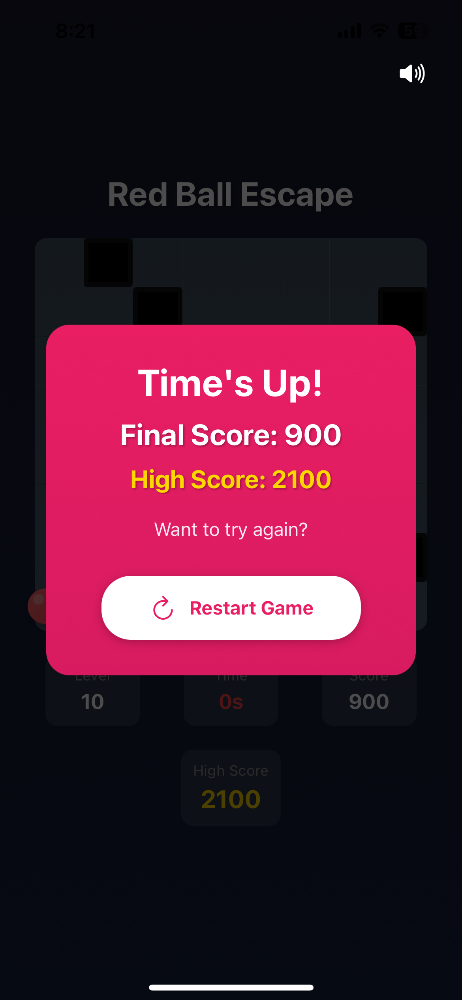

# 🎮 Red Ball Escape

**Red Ball Escape** is a fast-paced gyro-controlled maze game built using **React Native + Expo**. Navigate a red ball through dynamically generated mazes, dodge obstacles, and race against time to reach the goal. Designed for mobile devices, the game utilizes the device's gyroscope to create an immersive experience. Beat your own high score and test your reflexes!

---

## 📸 Screenshots

<p align="center">
  
  
  
</p>

---

## 🎥 Gameplay Video

[Download Gameplay Video](assets/screen.mp4)

## 🎥 Gameplay Video

[](assets/screen.mp4)


---

## 📁 Project Structure

```yaml
Ball-Maze-main/
├── .gitignore
├── App.tsx
├── app.json
├── assets/
│   ├── adaptive-icon.png
│   ├── favicon.png
│   ├── icon.png
│   ├── splash-icon.png
│   └── sounds/
│       ├── background.mp3
│       ├── collision.mp3
│       ├── gameover.mp3
│       ├── move.mp3
│       └── victory.mp3
├── components/
│   ├── Ball.tsx
│   ├── GameOver.tsx
│   ├── Maze.tsx
│   └── Victory.tsx
├── utils/
│   ├── mazeGenerator.ts
│   ├── soundManager.ts
│   └── useSound.ts
├── index.ts
├── package.json
├── package-lock.json
└── tsconfig.json
```

**Frontend**: React Native (Expo)  
**Language**: TypeScript  
**Motion**: DeviceMotion APIs (Gyroscope)  
**Sound**: expo-av

---

## 🔄 Getting Started

```bash
# 1. Clone the repository
git clone https://github.com/your-username/RedBallEscape.git
cd RedBallEscape

# 2. Install dependencies
npm install
# or
yarn install

# 3. Start the development server
npm start
# or
yarn start
```

---

## 🧠 Features

- 🔄 Gyroscope-based red ball movement
- 🧱 Auto-generated dynamic mazes
- ⏱️ Timer + Score + High Score tracking
- 🔊 Immersive sound effects
- 📱 Mobile-optimized design

---

## 💡 Future Improvements

- Global leaderboard (Firebase or Supabase)
- New maze themes and skins
- Power-ups and traps

---

## 🤝 Contributing

```bash
# Fork the repository
# Create your feature branch (git checkout -b feature/YourFeature)
# Commit your changes (git commit -m 'Add your feature')
# Push to the branch (git push origin feature/YourFeature)
# Open a Pull Request
```

---

## 📝 License

This project is licensed under the MIT License.

---

## 📣 Author

Made with ❤️ by **Sonal Jaiswal**  
📬 Reach out via [GitHub](https://github.com/sonal-jaiswal) 